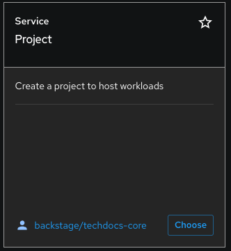
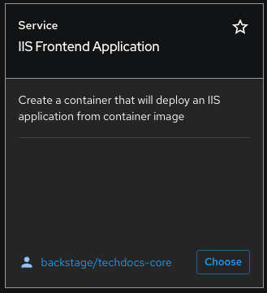

# Demo Provisoning

This demo will utilize the demo.redhat.com platform.  You will need to have access and the ability to request a Red Hat Developer Hub Demo catalog item.

## Prereqs
1. Ansible cli is installed on your local workstation
2. `PyYAML` python library is installed on your local workstation
3. `kubernetes` python library is installed on your local workstation
4. `typing-extension` python library is installed on your local workstation

```
python3.11 -m venv .venv
source .venv/bin/activate
pip install -r requirements.txt
```

## Request Environment

1. Request https://demo.redhat.com/catalog?search=developer+hub&item=babylon-catalog-prod%2Fenterprise.red-hat-developer-hub-demo.prod
2. Login to OpenShift web console with provided credentials and then login via the CLI in your local terminal
3. Make note of the gitlab `URL` `USERNAME` and `PASSWORD` from the Developer Hub Access Demo details

## Setup Demo Environment

You will need to run an ansible playbook to configure the additional items that will be required for this lab.
[TODO: List items provisioned by playbook]

1. Login to OpenShift cli using the provided credentials from the Developer Hub Access Demo details

```
Example: 

oc login -u admin -p 12345 https://api.cluster-abcd.abcd.sandbox42069.opentlc.com:6443    

Login successful.

You have access to 88 projects, the list has been suppressed. You can list all projects with 'oc projects'

Using project "default". 
```
 
2. Run the ansible playbook substituting the values for your root password from the demo.redhat.com console and the gitlab dns hostname as well
    ```
    cd ansible
    ansible-playbook --extra-vars "gitlab_host=<gitlab-hostname-here>" --extra-vars "root_password=<gitlab-root-password-here>" ./create_ocp_environment.yaml
    ```

Note: Do not include `https://` in the `gitlab_host` variable

This playbook will create two pinelines/pipeline runs

1. namespace `openshift-virtualization-os-images` - pipeline run `windows-efi-installer`
2. namespace `build-dotnet` - pipeline run `solacetk-ui`

Wait for these pipelineruns to complete before proceeding to the next steps.  
`windows-efi-installer` can take awhile to complete... go get some coffee... take the dog for a walk, etc...    
It took 38 minutes last time I waited for completion.


## Create Windows IIS App
This involves clicking "create" filling out two templates `Project` and `IIS Web Application`

### Steps:

1. **Launch Developer Hub Console**:

   - Log in as `user1`.
   - Click "Create" and select the `Project` catalog item.
   - Fill out the `Project` template:
     - **Component Name**: Provide a name for the new component.
     - **Owner**: Set this to `group:user1`.
     - **GitLab URL**: Enter your GitLab URL without the `https://` prefix.
     - **Development Item**: Leave this as the default value.
   - Complete the template setup.
  
  

2. **Create IIS Web Application**:

   - After the `Project` template is provisioned, create an `IIS Web Application` using the corresponding catalog item.
   - Keep defaults for all the steps

3. **Create Frontend Application**:

   - After the `IIS Web Application` template is provisioned, create an `IIS Frontend Application` using the corresponding catalog item.
   - Choose the backend you created in step 2
   - Keep defaults for IIS deployment options step


3. **Sync with ArgoCD**:

   - Wait for ArgoCD to automatically sync, or manually trigger the sync from the ArgoCD console.

4. **Verify in OpenShift**:
   - Locate the new project in the OpenShift console. For instance, if the project name is `test`, you will find a `test-dev` project.
   - Get the network route to confirm that the VM is correctly routing traffic.
